# Virtual Private Cloud (VPC) Deployment

## Creating a VPC

### 1. Navigate to VPC
- From the **AWS Console Home**, search **VPC** in the search bar  
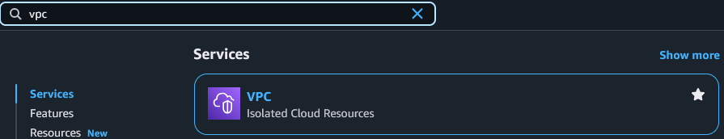

### 2. Create a New VPC
- Click **Create VPC** in the top-right corner of the page

### 3. Configure VPC Settings
- **Resources to create:** VPC only
- **Name tag:** Use a descriptive name e.g. tech503-caleb-2tier-first-vpc
- **IPv4 CIDR block:** Select IPv4 CIDR manual input
- **IPv4 CIDR:** Input your VPC block e.g. 10.0.0.0/16
- **Tags:** Ensure a tag is created
  - **Key:** Name
  - **Value:** e.g. tech503-caleb-2tier-first-vpc
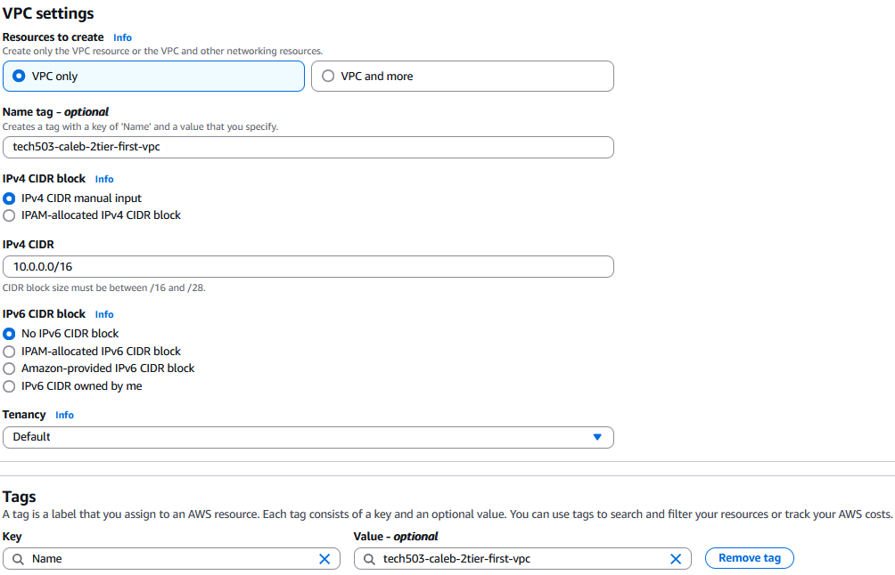

### 4. Create VPC
- Click **Create VPC** in the bottom-right corner of the page

## Creating Subnets

### 1. Navigate to Subnets
- From the **VPC dashboard**, go to **Subnets**  
    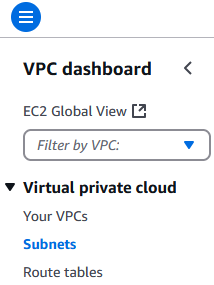

### 2. Create a New Subnet
- Click **Create subnet** in the top-right corner of the page

### 3. Configure Subnet Settings
- **VPC:** Select your previously created VPC
- **Subnet settings:**
  - **Subnet name:** Use a descriptive name e.g. tech503-caleb-public-subnet
  - **Availability zone:** Europe (Ireland) / eu-west-1a
  - **IPv4 subnet CIDR block:** Enter your subnet e.g. 10.0.2.0/24

> IMPORTANT: Do not click create yet!

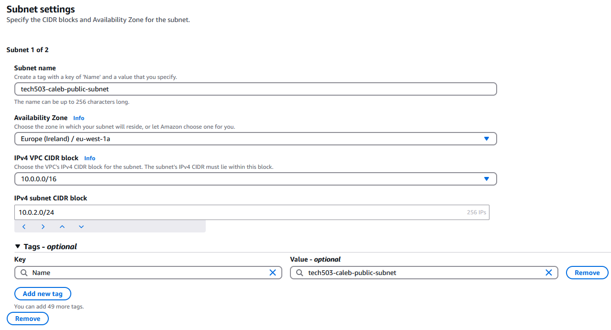

### 4. Add and Configure a New Subnet
- Click **Add new subnet** underneath the settings
- **Subnet settings:**
  - **Subnet name:** Use a descriptive name e.g. tech503-caleb-private-subnet
  - **Availability zone:** Europe (Ireland) / eu-west-1b
  - **IPv4 subnet CIDR block:** Enter your subnet e.g. 10.0.3.0/24

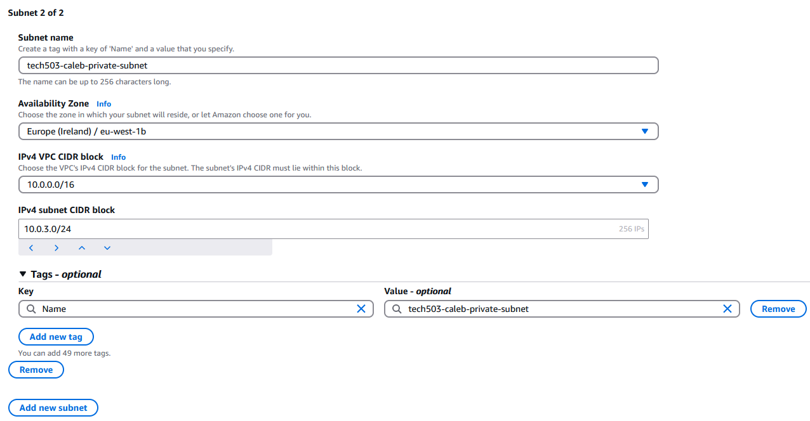

### 5. Create Subnet
- Click **Create subnet** in the bottom-right corner of the page

## Creating an Internet Gateway

### 1. Navigate to Internet Gateways
- From the **VPC dashboard**, go to **Internet gateways**  
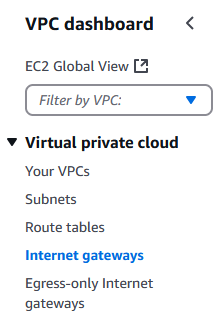

### 2. Create a New Internet Gateway
- Click **Create internet gateway** in the top-right corner of the page

### 3. Configure Internet Gateway Settings
- **Name:** e.g. tech503-caleb-2tier-first-vpc-ig
- Click **Create internet gateway** in the bottom-right corner of the page

### 4. Attach the Internet Gateway to a VPC
- Click **attach to a VPC** in the pop-up window after creation, or **Actions > Attach to a VPC**
- **Select your VPC**
- Click **Attach internet gateway** in the bottom-right corner of the page

## Creating a Route Table

### 1. Navigate to Route Tables
- From the **VPC dashboard**, go to **Route tables**  
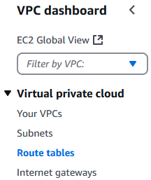

### 2. Create a New Route Table
- Click **Create route table** in the top-right corner of the page

### 3. Configure Route Table Settings
- **Name:** e.g. tech503-caleb-2tier-first-vpc-public-rt
- **VPC:** Select your VPC from the dropdown list
- Click **Create route table** in the bottom-right corner of the page

### 4. Configure Subnet Associations
- Click the **Subnet associations** tab on the route table details page
- Under **Explicit subnet associations**, click **Edit subnet associations**
- Tick the **public-subnet** that you created earlier
- Click **Save associations** in the bottom-right corner of the page

### 5. Configure Routes
- Click the **Routes** tab on the route table details page
- Click **Edit routes**
- Click **Add route**
  - **Destination:** 0.0.0.0/0
  - **Target:** Internet Gateway
  - **Select your Internet Gateway** in the dropdown box that appears
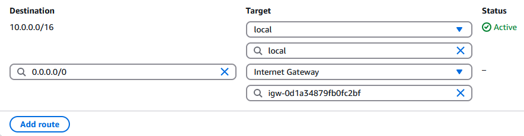
- Click **Save changes** in the bottom-right corner of the page

### Optional: Check Setup
- Navigate to **Your VPCs**  
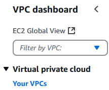
- Click the **VPC ID** link for your VPC
- Check the **Resource map** tab, it should look like this:
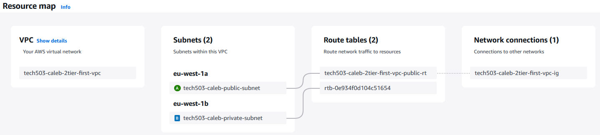

## Launch Database Instance

### 1. Navigate to EC2 Dashboard
- From the **EC2 Dashboard**, go to **Instances**  
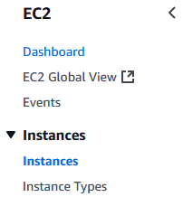

### 2. Launch a New Instance
- Click **Launch instances** in the top-right of the page

### 3. Configure Instance Settings
- **Name:** e.g. tech503-caleb-db-in-vpc
- **Application and OS Images:**
  - **My AMIs:** Owned by me
  - **AMI:** Select your Database Image
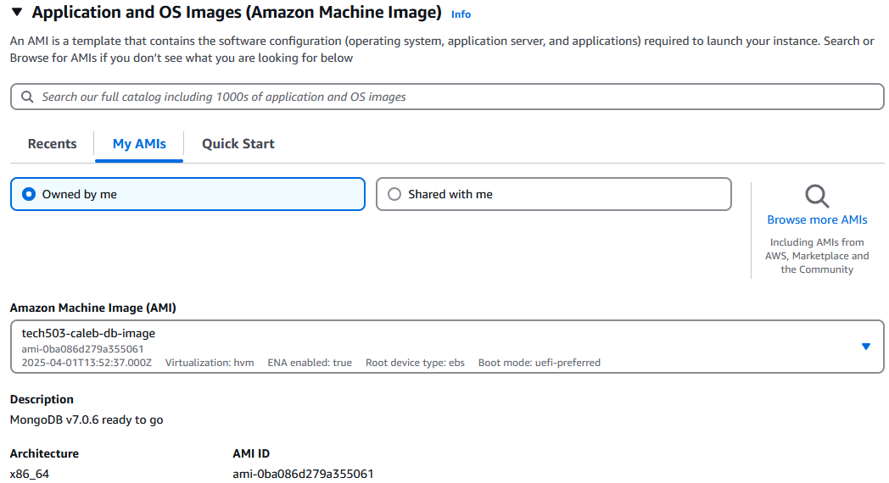
- **Instance type:** t2.micro
- **Key pair:** Select your key pair
- **Network settings:**
  - **VPC:** Select your VPC from the dropdown list
  - **Subnet:** Select your **private** subnet
  - **Auto-assign public IP:** Disable
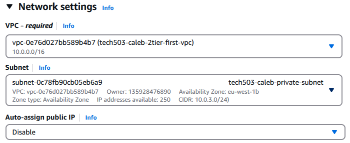
  - **Firewall:** Create security group
    - **Name:** e.g. tech503-caleb-db-sg-vpc
    - **Description** e.g. tech503-caleb-db-sg-vpc
    - **Add security rule:** Add security group rule
      - **Type:** Custom TCP
      - **Port range:** 27017 (MongoDB default port)
      - **Source:** 0.0.0.0/0 for ease of testing (specific CIDR block would be more secure 10.0.3.0/24)
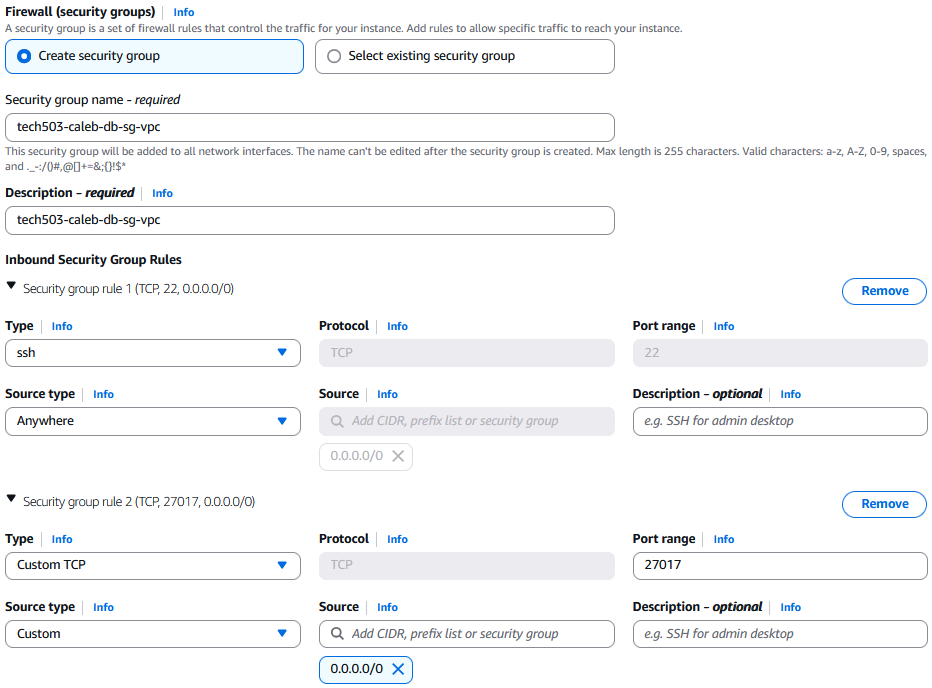

### 4. Launch Instance
- Click **Launch instance** in the bottom-right corner of the page

## Launch App Instance

### 1. Navigate to Instances
- From the **EC2 Dashboard**, go to **Instances**  

### 2. Launch a New Instance
- Click **Launch instances** in the top-right of the page

### 3. Configure Instance Settings
- **Name:** e.g. tech503-caleb-app-in-vpc
- **Application and OS Images:**
  - **My AMIs:** Owned by me
  - **AMI:** Select your App Image
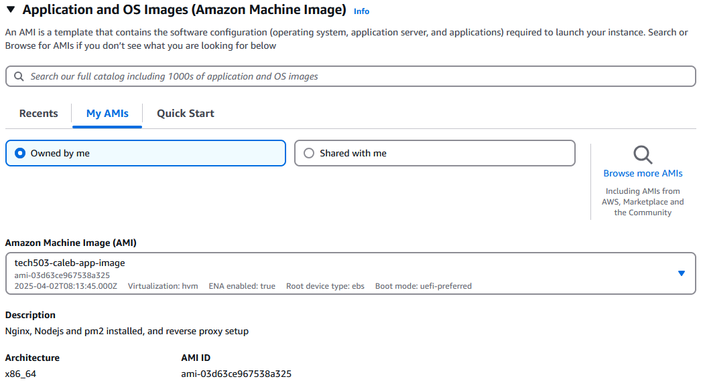
- **Instance type:** t2.micro
- **Key pair:** Select your key pair
- **Network settings:**
  - **VPC:** Select your VPC from the dropdown list
  - **Subnet:** Select your **public** subnet
  - **Auto-assign public IP:** Enable
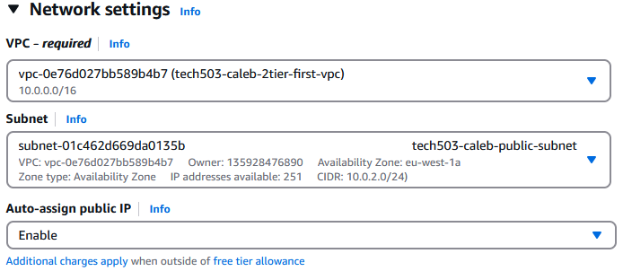
  - **Firewall:** Create security group
    - **Name:** e.g. tech503-caleb-app-sg-vpc
    - **Description** e.g. tech503-caleb-app-sg-vpc
    - **Add security rule:** Add security group rule
      - **Type:** HTTP
      - **Source:** 0.0.0.0/0
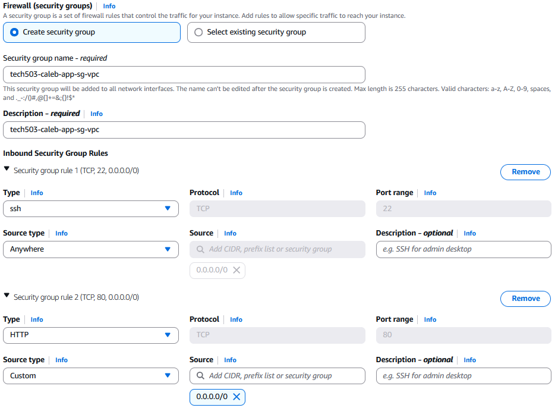
- **Advanced details:**
  - **User data:** Add user data to facilitate the deployment of the app
    - **Set DB environment variable**
    - **Seed the DB**

### 4. Launch Instance
- Click **Launch instance** in the bottom-right corner of the page

## Termination

> Important: There is an order to follow when terminating this setup

### 1. Terminate the Instances
- From the **EC2 dashboard**, go to **Instances**
- Select both the **database and app instances**
- Click **Instance state > Terminate (delete) instances**

### 2. Terminate the Security Groups
- From the **VPC dashboard**, go to **Security groups**  
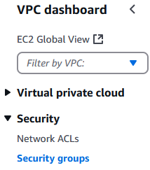
- Select both **VPC** security groups for the database and app instances
- Click **Actions > Delete security groups**
- Type **delete** into the pop-up window to confirm deletion

### 3. Terminate the VPC
- From the **VPC dashboard**, go to **Your VPCs**
- Select your **VPC**
- Click **Actions > Delete VPC**
- Type **delete** into the pop-up window to confirm deletion
